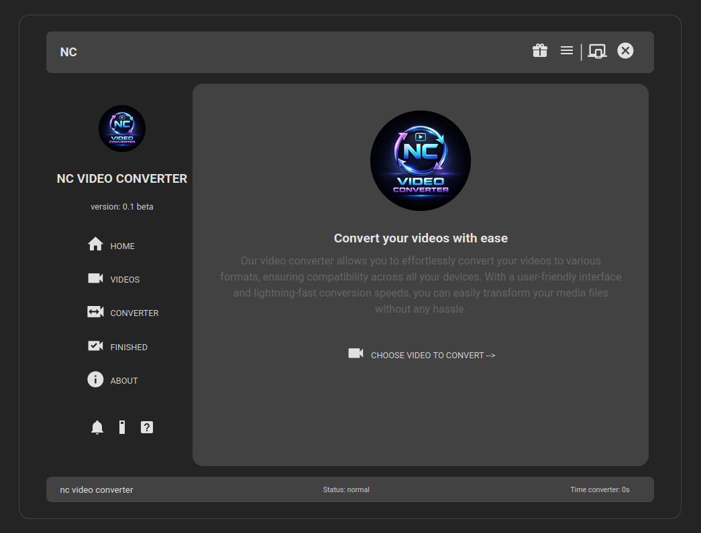
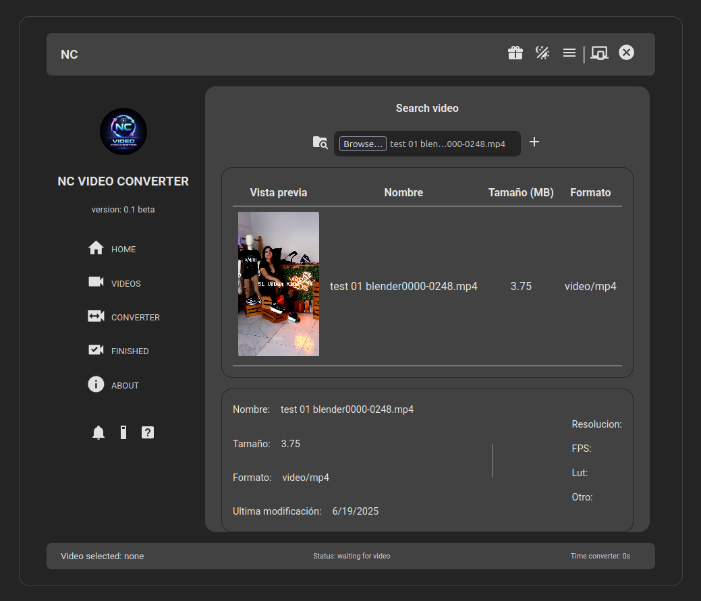

# NC VIDEO CONVERTER
- Aplicativo convertidor de video desarrollado con Web Components (LIT), Rust y la libreria FFmpeg 

 

## TECNOLOGIAS
* Frontend: Web Components (LIT)
* Backend: RUST API (Axum)
* Desktop: RUST (Tauri)
* Libreria FFmpeg

 

## PWA / WEB

### Home

 

### Select folder video

 

